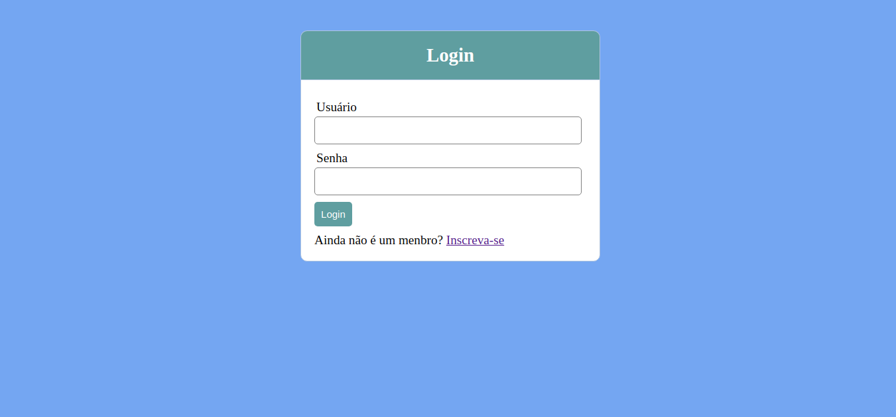
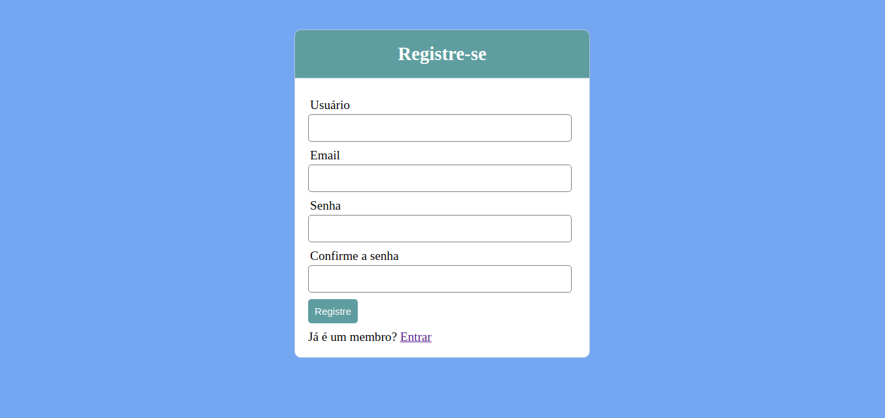
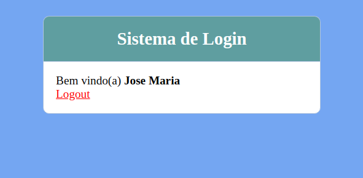

<h2 align="center">
  SISTEMA PARA CADASTRO DE LOGIN DE USUÁRIOS
</h2>

<h4 align="left">
  Tela inicial para login de usuário.
</h4>



---

## Banco de dados
Crie um banco de dados e execute as instruções SQLs abaixo para criar a tabela `users`:

```
  CREATE TABLE users (
	id int(11) not null auto_increment,
    usuario varchar(120) not null,
    email varchar(120) not null,
    senha varchar(120) not null,
    primary key(id)
)
```
---

<h4 align="left">
  Caso o usuário ainda não possua cadastro, o mesmo é direcionado para tela de Registre-se.
</h4>



<h4 align="left">
  Ao finalizar o processo de cadastro, o sistema apresenta a tela de confirmação com as boas vindas!
</h4>



---

## Tecnologias e ferramentas utilizadas
Para o desenvolvimento deste projeto utilizei:

- PHP 8.0.12
- MySQL 5.7
- Sublime Text 3
